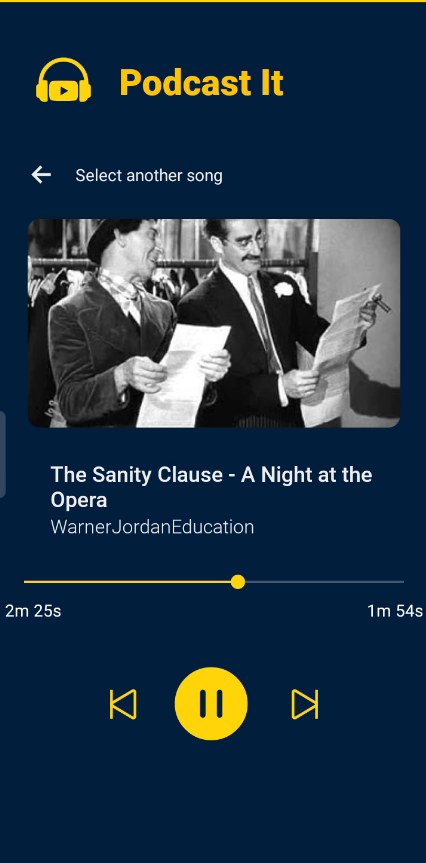

# Podcast It


## Table of Contents

1. [Overview](#overview)
2. [Features](#features)
3. [Installation](#installation)
4. [Usage](#usage)

## Overview

"Podcast It" is an Android app that allows users to convert YouTube video URLs into podcasts. Simply input a YouTube URL, and the app will play only the audio track, allowing you to listen to it like a podcast.

This project is inspired by [this tutorial](https://medium.com/@gionata.brunel/implementing-react-native-track-player-with-expo-including-lock-screen-part-2-android-8987e374f965).

<table>
<tr>
<td>

</td>
<td>

</td>
</tr>
</table>

## Features

- Convert YouTube URLs to audio tracks
- Play audio in the background
- Control audio playback via lock screen controls

## Installation

Clone the repository:

```bash
git clone https://github.com/displaynone/podcast-it.git
cd podcast-it
```

Install the dependencies:

```bash
npm install
# or
yarn install
```

Run the app:

```bash
npm run android
```

## Usage

- Open the app
- Input a YouTube URL into the input field
- Press the "Load video" button
- Enjoy your podcast

